# Care Management System (CMS)
A subsection of Complete Care Portal (CCP)

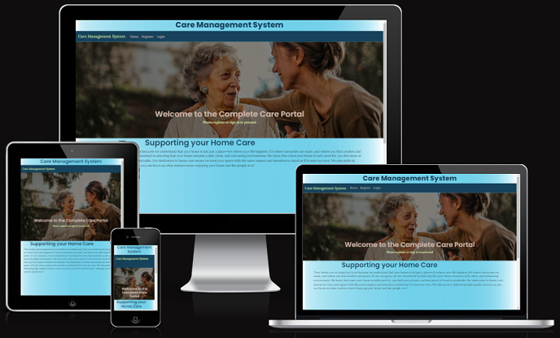

## A Care Notes Management System primarily for carers.
CMS manages notes about clients that have been assigned to carers. Allowing access for review and update in situ while maintaining medical data security.

# **[Link to Live Site](https://client-management-system-8d776b4f8b61.herokuapp.com/cms/)**  

*This a final FullStack Bootcamp (Berks) project for the Code Institue.*  

**Built by Duncan Thow**

---

# Table of Contents  

 1. [ UX ](#ux)
 2. [ Agile Development ](#agile-development)
 3. [ Features implemented ](#features-implemented)  
 4. [ Features Left to Implement ](#features-left-to-implement)  
 5. [ Technology used ](#technology-used) 
 6. [ Testing ](#testing-and-Validation)  
 7. [ Bugs ](#known-bugs)  
 8. [ Deployment](#deployment)
 9. [ Resources ](#resources)  
 10. [ Credits and acknowledgements ](#credits-and-acknowledgements)

---

# UX

## Database Planning

Due to a refocusing halfway through my final project (which will be expanded upon under Agile Development) my original database entity relationship diagrams (hereinafter referred to as ERD's) are slightly different from those now in use.  While there is a 'register' feature on the Care Management System this does not automatically create an **authenticated** new user.  A site admin **must** grant a user the correct access rights ('carer' and then correct clients) to ensure a clients medical details data security.
  

## UX Design

### Overview
Care Management System is designed to securely hold details on a clients care regime.  This includes the clients condition upon being added to the site and notes for ongoing care as provided by a carer.  The site aims to promote a calm and soothing aesthetic to appeal to both clients and carers.

### Site User
The primary users of the Care Management System are carers who have been assigned clients by their administrators / Team Leaders. They should be able to swiftly located their clients in a list and be able to add, edit or delete notes as required for any client they are assigned to be a carer of.

### Goal
The goal behind the Care Management System is to create an easy and intuitive method of both reviewing and recording their clients condition and care regime.  It is also vital that this system is secure to ensure that a clients medical details cannot be viewed by external parties or internal parties that are not assigned to a client.  This will necessitate frequent staff (or administrator) management of the carer to client relationship via the administrative login.

## Wireframes

I used Balsamiq to create my wireframes. The final product looks a significantly different to original intentions due previously mentioned refocussing.  This included moving from a client to a carer focused project.  Though the actual details are significantly different the spirit remains consistent with a view to incorporating these wireframes into the projects current iteration at a later date.
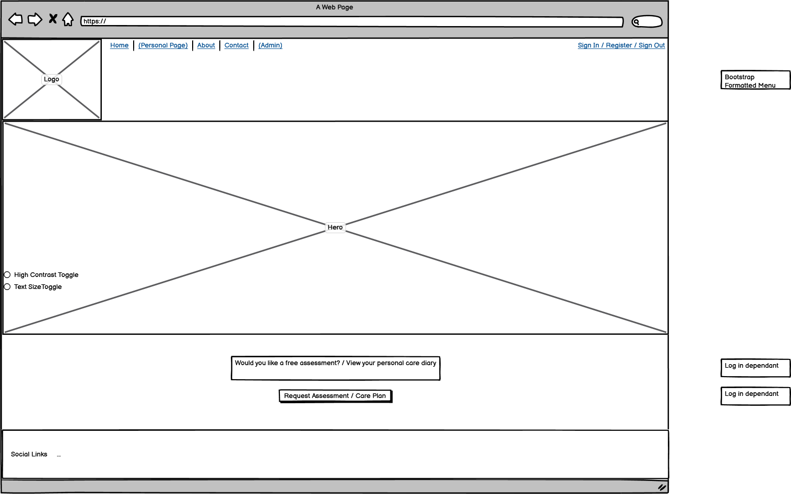

The original concept was for clients to signup or login and then have access to a calendar which would detail their appointment dates which would link to notes that the clients could create, review, update or delete in order to provide feedback from the clients point of view towards the event.

As the original concept was to be client facing I also envisaged an 'About' page detailing the services provided; a 'Contact' page so that prospective clients could make enquires about the services; and a 'Request Assessment' page (which would also function as a site registration page) so that a prospective client could book a clinical review prior to being add as a client

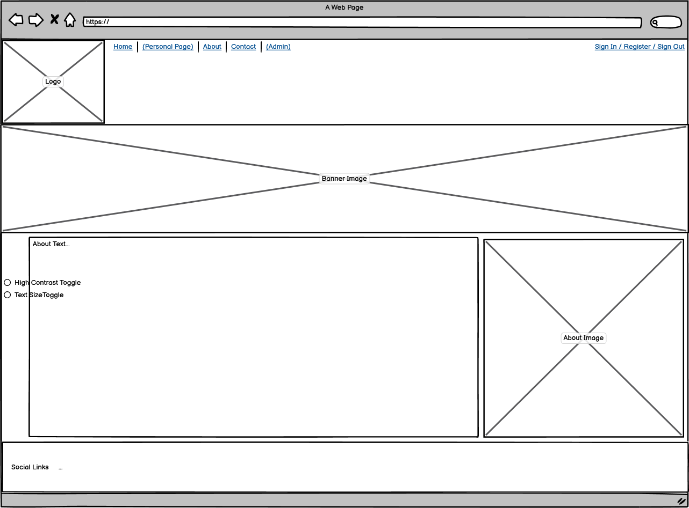
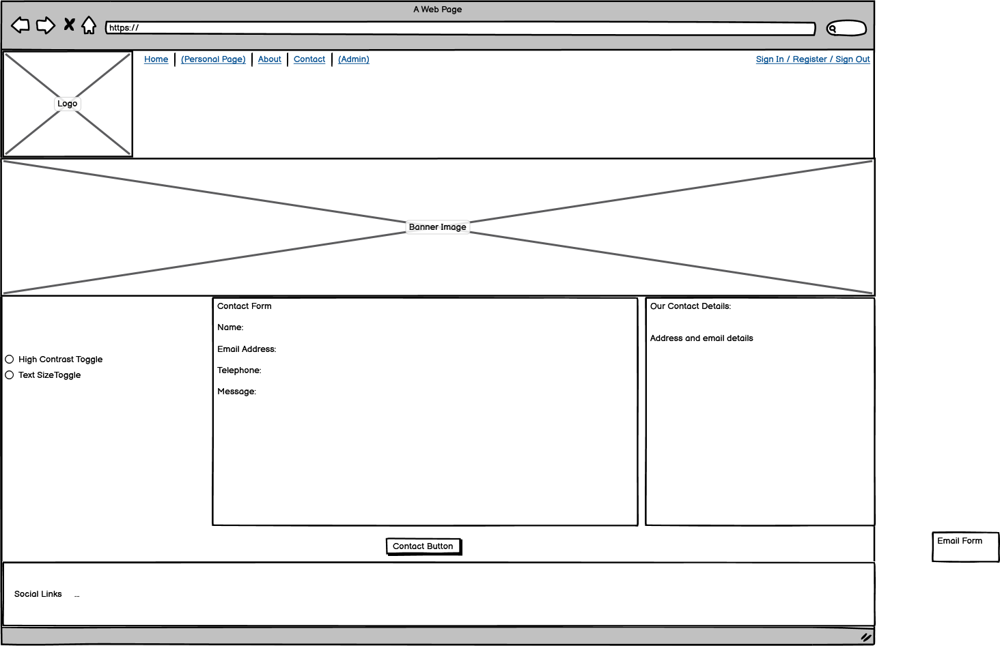

While the header has remained largely the same as the intended concept the footer has change.  Most notably due to the fact that linking social media accounts to a system holding sensitive medical details would be at the very least problematic.

##### [ Back to Top ](#table-of-contents)

# Agile Development

While I have used Agile methodology throughout the development of the Care Management System I have pivoted significantly away from the original core concept.  This is due to the fact that at this point in my development career I found creating a fully fledged interactive calendar with CRUD functionality and linked notes a significant hurdle.  I have moved most of those features to the 'Future Features' section of the Kanban board and followed new user stories.

In addition I created a Site Flow map to aid my visualisation of a users navigation of the website.

[Project Board](https://github.com/users/CI-Duncan/projects/4)

## Kanban Board Overview

While using the [KanBan ](https://github.com/users/CI-Duncan/projects/4)board I organised it into the following sections:

- **To Do:** This section contained all the tasks and user stories that were yet to be prioritized for implementation.
- **In Progress:** Work in progress was tracked here, indicating tasks actively being worked on.
- **Done:** Tasks that were completed successfully were moved to this column.
- **Future Features:** Ideas and tasks earmarked for future development were kept in this section for consideration in subsequent iterations.

I also used MoSCoW as detailed below:
- **P0:** This was Must-Have
- **P1** This was Should-Have.
- **P2** This was Could-Have.
- **(empty)** Was Wont-Have

### User Stories Integration

As user stories are a core of Agile Methodology they were used to define the tasks on the KanBan board.  This is to ensure that the project can match with user requirements.

### Task Management

The Kanban board has been used to both track user stories and to ensure that there was a list of tasks that could be monitored and velocity measured against.  This enabled me to break down larger tasks in to more manageable objectives.

This use of Agile principles also helped me realise that my original Django project would not be achievable at my then velocity which allowed me to pivot to a related yet entirely different concept that could be integrated with my original idea at a later date.

## User Stories Overview

1. **Title:** Implement User Registration
   - As a **user**, I can **register for an account** so that **my details will be retained**.

2. **Title:** Enable User Authentication
   - As a **registered user**, I can **log in** to my account that **I can access diary features**.

3. **Title:** Client Notes Form
   - As a **registered user**, I can **create note entries** so that admin and other carers are **aware of my actions with the client**.

4. **Title:** Display a list of clients
   - As a **registered user**, I can **view a list of clients** assigned to me by the admin  team so that **I quickly located the condition and notes for an assigned client**.

5. **Title:** Create Note Functionality
   - As a **registered user**, I can **create a note for a client** so that **I inform other carers who look after the same client of what care has been provided**.

6. **Title:** Create Profile Page
   - As a **registered user**, I can **create a new client ** with personal and medical details so that  **I add clients I may have attended who are not on the system**.

##### [ Back to Top ](#table-of-contents)

# Features Implemented

## Home Page:
  - Logon system which must be secure.
  - CTA if not signed in.
  - Users can click on a blog card to read the entire post.

## Footer/Nav Bar:
  - Copyright information.
  
## Clients Page:
  - List of clients assigned to the user
  - Users can select any of their clients but not clients to assigned to them

## Client Details Page:
 - Name and pertinent details displayed.
 - Ability to update client details or delete the client.
 - Ability to see and interact with the clients notes.
 - Ability to delete notes if required (with warnings)
  
## New Note Page:
  - Allows creation of note assigned to client from above Client Details Page.

## Note View Page:
  - Note Title and details displayed as well as the Note Author and time of Note creation.
  
## Note Edit Page:
  - Title and Content of Note editable.
  - After successful logout, users are redirected to the home page.

## Add Client Page:
  - Full details of client able to be added from this page.
  - Note to inform carers inputting clients that they will not be access the client until administrative intervention

### Responsive Design:

   - The website is designed with responsive design methodologies in mind.
   - Navbar collapses, text resizes and margins are changed to aid navigation on smaller devices .

## Additional Security Features:

   - Prevention of brute force actions via URL.
   - Prevention of users accessing non-assigned clients.
   - Prevention of users posting as other users.

##### [ Back to Top ](#table-of-contents)

# Future Features

Primary future features would be implementation of the original project plan.

Additionally improving some of the UX features so that the forms sit more naturally on larger pages and the look and feel of the buttons are more consistent.

##### [ Back to Top ](#table-of-contents)

# Technology Stack

- HTML - for page structure
- CSS - for custom styling
- Python - for the backend
- Javascript - for (an) event listener on (a) buttons
- Django - framework used to build this project
- Bootstrap 5 - front end framework used for styling
- Heroku PostgreSQL - used as the database
- Balsamiq - for wireframes
- Lucidchart - for database ER diagrams
- Pexels - for free stock images
- Google Fonts- for custom font styling
- GitHub - for storing the code and for the Kanban board
- Heroku - for hosting and deployement of this project
- Git - for version control

##### [ Back to Top ](#table-of-contents)

# Testing and Validation

## Responsiveness

I used Chromes in built LightHouse feature of DevTools to test for site responsiveness with the results as follows:

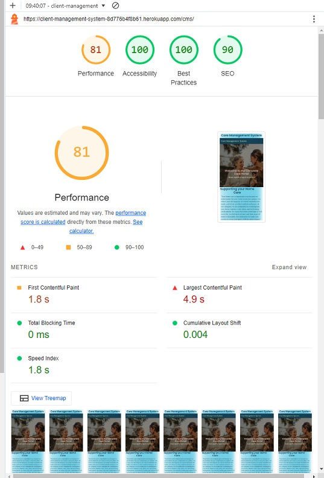

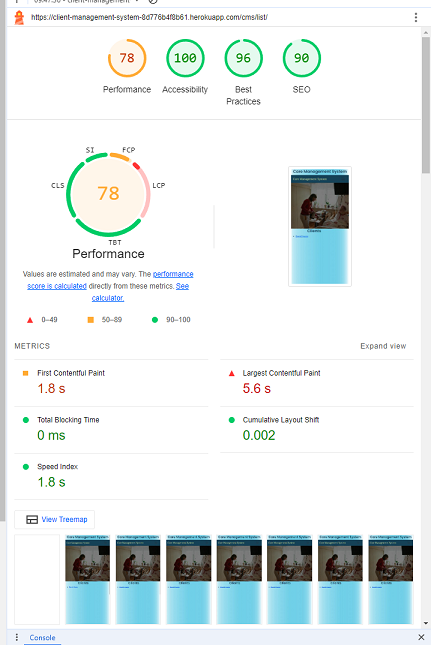

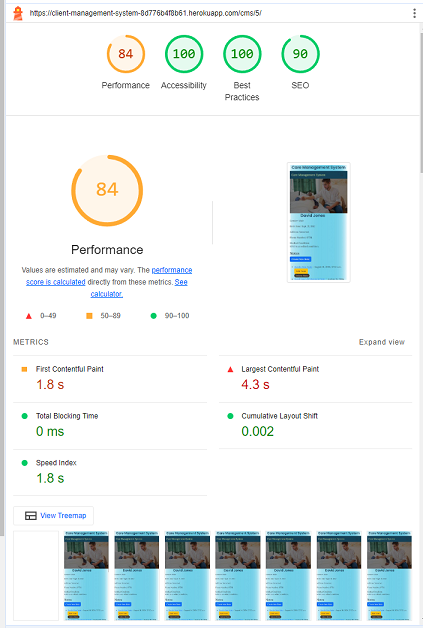

-- Navbar collapses to a burger bar on smaller screen sizes
-- Content stacks vertically instaed of horizonstally on smaller screen sizes

    enter code here

## Testing and Validation
- I used the [W3 HTML Validator](https://validator.w3.org/#validate_by_input+with_options) for checking the site for HTML errors.  In order to compensate for the Django code I validated by URL.

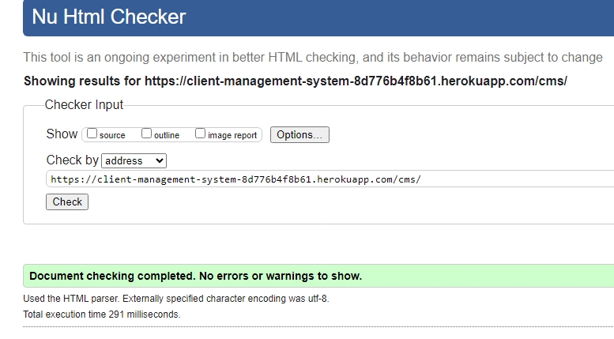

There was error in the Bootstrap NavBar that I haven't been able to fix without breaking the navigation links:

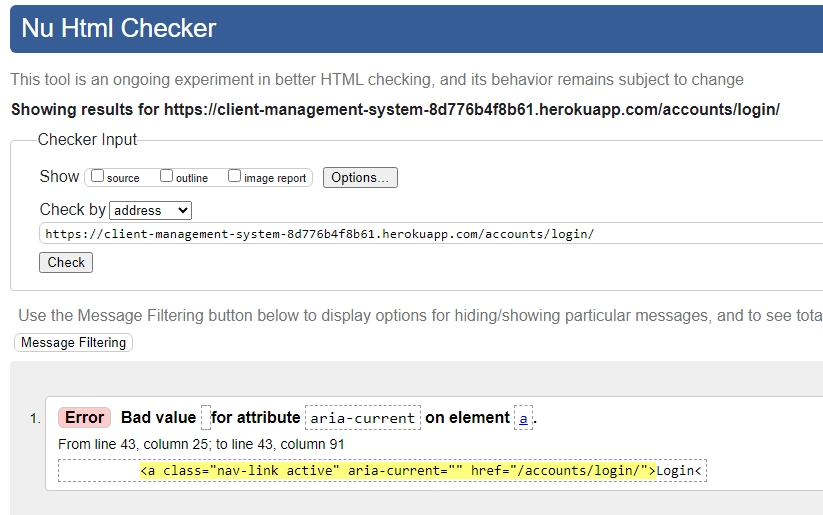

  
- For CSS I used [W3 CSS Validator](https://jigsaw.w3.org/css-validator/#validate_by_input) as my error checker and found no errors.  In this instance I used direct text input of my file.

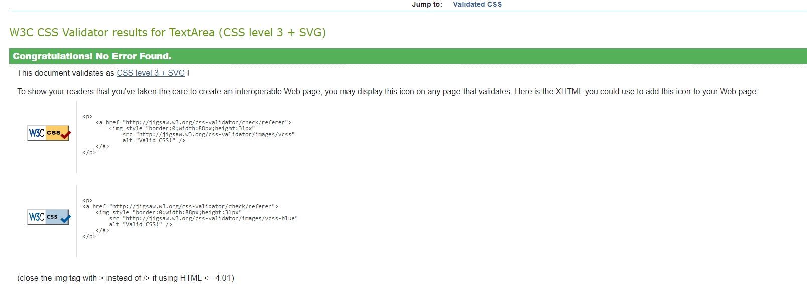
  
- For the Python code I used the [CI Linter](https://pep8ci.herokuapp.com/).  I had numerous Line too Long Errors (due to code comments) and some E302 'expected 2 blank lines' after Code definitions

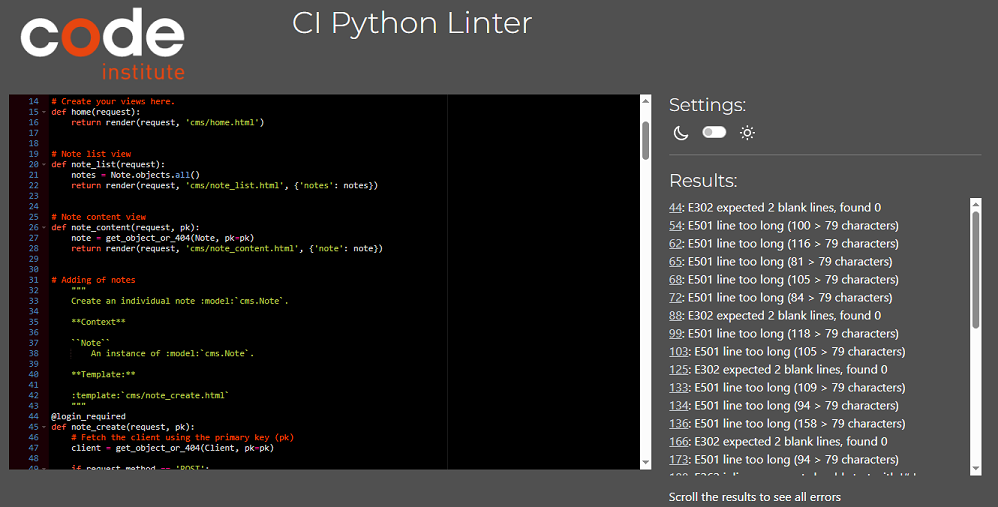

### Manual Testing Results

### HOME PAGE

| Test                                     | Result |
|-----------------------------------------|--------|
| Cannot access client data if not logged on          | Pass   |
| Call to Action displayed if not logged on| Pass   |

### Client List Page

| Test                                     | Result |
|-----------------------------------------|--------|
| List of Clients displayed           | Pass   |
| Only assigned clients displayed             | Pass   |

### Client Details PAGE

| Test                                     | Result |
|-----------------------------------------|--------|
| Correct details displayed                   | Pass   |
| Edit client form functionality        | Pass   |
| Delete client form functionality           | Pass   |
| Redirect after submission or cancellation          | Pass   |
| Redirect after submission or cancellation          | Pass   |
| Create note form functionality        | Pass   |
| Edit note form functionality        | Pass   |
| Delete note form functionality           | Pass   |

### REGISTRATION PAGE

| Test                                    | Result |
|----------------------------------------|--------|
| Secure login functionality             | Pass   |
| Redirect after successful registration | Pass   |

### LOGOUT PAGE

| Test                                    | Result |
|----------------------------------------|--------|
| Logout functionality                   | Pass   |
| Redirect after successful logout       | Pass   |

### SECURITY

| Test                                                             | Result |
|-----------------------------------------------------------------|--------|
| Prevention of brute force actions via URL                        | Pass   |
| Redirect to sign-in page after attempted unauthorized action | Pass   |
  
When attempting to access a client list, client details, or note via a known good URL but when not logged in the CMS website will display the sign in page.

##### [ Back to Top ](#table-of-contents)

# Known Bugs

- **Currently the Sign In page is not styled inline with the rest of the site.**  
The default layout of the sign in pages are still in effect.

- **There forms and note correctly styled.**
Some forms still have their default styling and are all aligned hard to the left.  This is visually unappealing.  The Add New Client form has had Crispy Forms applied to it but the styling there still requires refinement

 - **There is no favicon **
This is currently missing and requires insertion.

##### [ Back to Top ](#table-of-contents)

##### [ Back to Top ](#table-of-contents)

# Resources

- [Code Institute Full Stack Development course materials](https://codeinstitute.net/) 
- [Django docs](https://www.djangoproject.com/)
- [Crispy forms docs](https://django-crispy-forms.readthedocs.io/en/latest/)
- [Cloudinary docs](https://cloudinary.com/documentation/programmable_media_overview)
- [Bootstrap docs](https://getbootstrap.com/docs/5.0/getting-started/introduction/)
- [Stack overflow](https://stackoverflow.com/)
- [Code Institude Slack](https://slack.com/)

##### [ Back to Top ](#table-of-contents)

# Credits and Acknowledgements

## Images
- Banner featured images were taken from royalty free stock photos on [Pexels](https://www.pexels.com/)

## Code

 - **Code Institute** course content for providing the knowledge and guidance to build the project
 - And,  of course, the team at CI including (but not limited to):
 - My mentor **Alexander** for his continued support and ability to listen to my waffle.
 - Code Guru's **Kevin Loughrey** and **Martin McInerney**  for their ability to describe complex ideas simply and in a relatable manner.
 - The entire Berkshire Bootcamp for showing me what was possible and being there when it wasn't quite achieved.
 
##### [ Back to Top ](#table-of-contents)

<!--stackedit_data:
eyJoaXN0b3J5IjpbMTM2MTA2Mjk2NiwxMTIyMzQ4MzQyLC00NT
gwNzAzMjcsMTc3NzgyNjI0MCw4NDEyNzI3MzgsLTIxMzI2MzMy
NDAsLTYzMDEzNzgsMzMxNTI5NTY2XX0=
-->